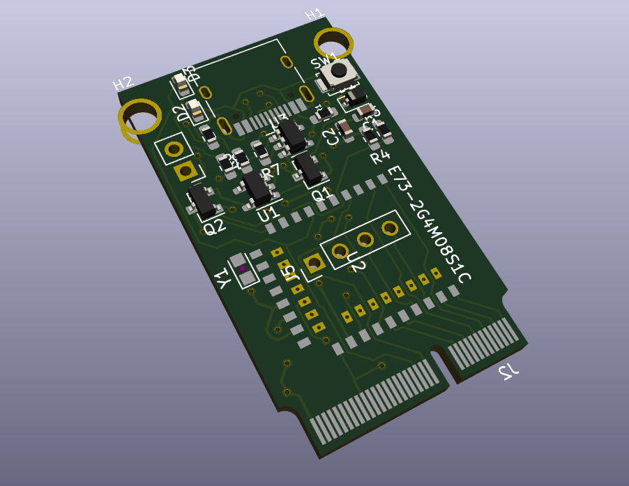

## NOTE: Not complete, do not use as is. 

### ToDo - update silk screen labels. Check schematic. Update gerbers. 

### Design based largely on nrfmicro from: https://github.com/joric/nrfmicro

### m.2 stuff from here : git@github.com:antmicro/m2-pcie-adapter.git

